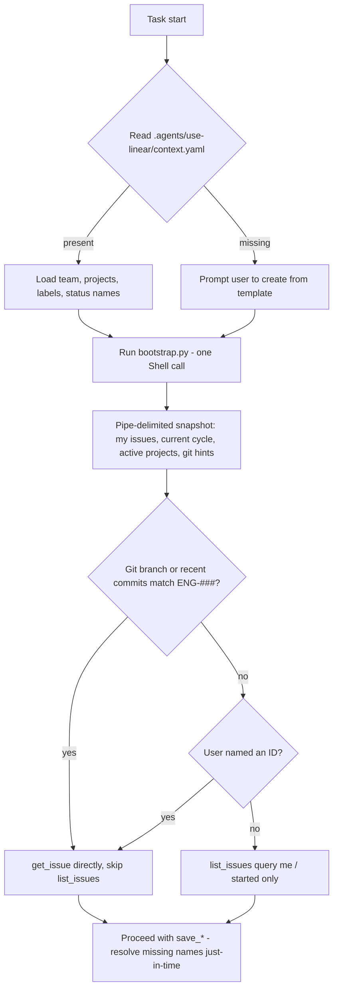

# Linear Skill: Eliminate Start-of-Task Discovery Round-Trips

## Problem

[skills/use-linear/SKILL.md](skills/use-linear/SKILL.md) line 36 (core principle "Discover, don't invent") forces the agent to call `list_teams`, `list_projects`, `list_issue_labels`, `list_issue_statuses`, `list_cycles`, and `list_issues` before doing anything — five to six sequential MCP round-trips every task start, even when nothing has changed.

## Approach — A + D (token-compact formats)

- **A (static context file):** user-curated defaults in `.agents/use-linear/context.yaml` (gitignored). YAML chosen over markdown for ~20% fewer tokens on small structured config while staying human-editable. The skill reads it first and trusts its names/IDs.
- **D (bootstrap script):** `skills/use-linear/scripts/bootstrap.py` hits Linear's GraphQL API directly (using the token already in [.mcp.json](.mcp.json)) and prints a **pipe-delimited** session snapshot with a minimal markdown preamble. ~30% fewer tokens than a markdown table for the same data.

After bootstrap, `list_*` calls are demoted to **just-in-time** — only when resolving a name not covered by context/snapshot, immediately before a `save_*`.

## Data flow



## Files

### New

- **[.agents/use-linear/context.yaml](.agents/use-linear/context.yaml)** — user's local context (gitignored). YAML. Filled by the user, one-time. ~60 tokens vs ~75 for markdown.
- **[skills/use-linear/references/CONTEXT.md](skills/use-linear/references/CONTEXT.md)** — committed reference: YAML schema, field meanings, and a copy-paste template. Used to scaffold the user's local `.agents/use-linear/context.yaml`.
- **[skills/use-linear/scripts/bootstrap.py](skills/use-linear/scripts/bootstrap.py)** — Python script (stdlib only — uses `urllib.request` for HTTP to avoid deps) that:
  - Reads the Linear token from `.mcp.json` at the repo root (fallback: `LINEAR_API_KEY` env var).
  - Issues **one GraphQL query** bundling: viewer identity; my issues with `state.type in (started, unstarted)`; active cycles per team; active projects; workflow states per team.
  - Parses `git branch --show-current` and `git log -n 20 --pretty=%B` for `ENG-\d+` / `Linear: ENG-\d+` hints.
  - Emits a **pipe-delimited** snapshot under section headers (see format below). Graceful fallback (exit 0 with a short `# bootstrap: <reason>` line) on network/auth errors so the skill degrades cleanly to the MCP flow.

### Edits

- **[skills/use-linear/SKILL.md](skills/use-linear/SKILL.md)**
  - Replace core principle #3 ("Discover, don't invent") with **"Bootstrap first, discover lazily"** (lines 36–37). Keep the anti-invention spirit but make it just-in-time.
  - Add a new **"Session Bootstrap"** section before "The Parallel-Progress Protocol" describing: (1) read `.agents/use-linear/context.yaml` if present, (2) run `scripts/bootstrap.py`, (3) use the snapshot plus git hints to answer "what's being worked on?" without `list_*`.
  - Include a short note about the pipe-delimited snapshot format so the agent knows to parse it by line prefix / column.
  - Rewrite protocol step (a.1) "Find an existing issue" (line 50): prefer snapshot/git-derived ID → `get_issue`; only call `list_issues({ assignee: "me", state: "started" })` if nothing matched, and only call broader `list_issues` after that.
  - Update the Reference Documentation table to add `CONTEXT.md`.
- **[skills/use-linear/references/WORKFLOW.md](skills/use-linear/references/WORKFLOW.md)** — rewrite step (a.1) and (a.2) to reference the bootstrap snapshot + YAML context file before any `list_*`. Keep the "Draft and confirm before creating" confirmation gate unchanged.
- **[skills/use-linear/references/CHEATSHEET.md](skills/use-linear/references/CHEATSHEET.md)** — add a "Session bootstrap" header with a single-line `python skills/use-linear/scripts/bootstrap.py` example and a note that `list_*` calls are now just-in-time.
- **[.gitignore](.gitignore)** — append `.agents/use-linear/` so the user's local context file is never committed.

## Example context file — YAML (for the user to fill)

```yaml
team: ENG
projects: [Infrastructure Hardening Q2, Platform Reliability]
labels: [backend, frontend, bug, security, tech-debt, p0, p1]
uses_cycles: true
states:
  in_progress: In Progress
  in_review: In Review
  done: Done
```

## Example bootstrap.py output — pipe-delimited (consumed as one tool-call result)

```
# linear snapshot 2026-04-24T10:02Z | viewer: elliott@... | team: ENG

## issues (id|state|title|project|cycle)
ENG-789|In Progress|Rate limit /api/search|Infrastructure Hardening Q2|Sprint 14
ENG-791|In Progress|Fix session refresh race|Platform Reliability|Sprint 14

## cycles (team|name|ends)
ENG|Sprint 14|2026-05-02

## projects (name|health|target)
Infrastructure Hardening Q2|atRisk|2026-05-31
Platform Reliability|onTrack|2026-06-15

## git (key|value)
branch|feat/search-rate-limit
linear_trailer|ENG-789
```

Column headers live inside section headers (one line per section) — not repeated on every row. Agent parses by splitting on `|`. ~30% fewer tokens than the equivalent markdown table/bullet form.

## Non-goals

- No caching the bootstrap output across sessions (always fresh — it's one call).
- No auto-writing back to `context.yaml` from the script (user owns that file).
- No changes to the `save_*` write-path or the confirm-before-create rule.
- No changes to the git-commit-trailer convention in [references/GIT.md](skills/use-linear/references/GIT.md).

## Risks and mitigations

- **Token read from `.mcp.json`.** File is already gitignored. Script also accepts `LINEAR_API_KEY` env var.
- **Bootstrap fails (offline / token expired).** Script exits 0 with a one-line `# bootstrap: <reason>` notice; skill falls back to the current `list_*`-based flow — no regression.
- **Stale `context.yaml`.** Script output augments/overrides names where it finds disagreement; SKILL.md instructs the agent to trust live data when context and snapshot disagree.
- **YAML indentation errors from hand editing.** `CONTEXT.md` template uses flow-style (`[a, b, c]`) for lists and only one level of nesting (for `states`) to minimize foot-guns. Script skips the file cleanly if YAML parse fails.
- **GraphQL schema drift at Linear.** Query uses only stable top-level fields; failures degrade gracefully to the MCP-based flow.