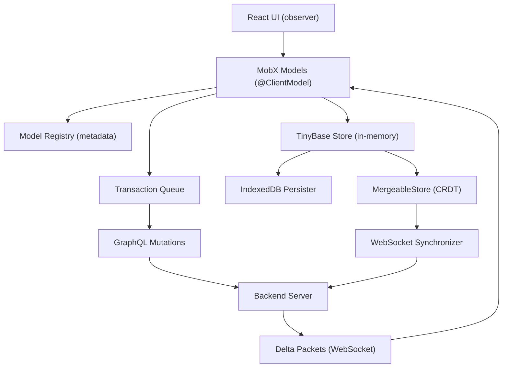

# Reactive Local-First Sync Engine Skill

## Context and Design Rationale

This skill encodes a hybrid local-first architecture inspired by Linear's sync engine (as documented in the [reverse engineering study](https://github.com/wzhudev/reverse-linear-sync-engine) and three talks by Tuomas Artman) but built on TinyBase rather than a fully custom solution. The goal is to deliver **Linear's developer experience** (decorator usage, OOP models, `issue.title = "New"; issue.save()`) while leveraging **TinyBase's built-in CRDT sync, IndexedDB persistence, and React hooks** as the storage foundation.

The existing reference implementation at `~/Work/development/wip/index-engineering/local-first-starter-reference/reference/sync-engine` and `reference/web-app` already demonstrates the core patterns (decorators, model registry, MobX integration, transaction classes, TinyBase store singleton). The skill will formalize and extend these patterns into a complete architectural guide.

## Skill Structure

Following the conventions established by `[nestjs-domain-driven-hexagon](skills/nestjs-domain-driven-hexagon/SKILL.md)`:

```
skills/reactive-local-first-sync-engine/
  SKILL.md                          # Main entry (<500 lines)
  references/
    MODEL-DEFINITION.md             # Decorators, ModelRegistry, property types, relationships
    TINYBASE-FOUNDATION.md          # TinyBase store, schema, persistence, MergeableStore integration
    TRANSACTION-SYSTEM.md           # Transaction types, queue, batching, GraphQL generation, undo/redo
    SYNC-PROTOCOL.md                # Bootstrapping, delta packets, WebSocket sync, conflict resolution, lazy loading
    REACT-PATTERNS.md               # observer(), Suspense, lazy hydration, component patterns, Zustand for chrome
    CHEATSHEET.md                   # Quick reference, decision trees, new feature checklist
```

## SKILL.md Content Outline

The main SKILL.md will contain:

- **Frontmatter**: name, description (keyword-rich for triggering on local-first, sync engine, TinyBase, MobX, offline-first, reactive models, optimistic UI, transaction queue, decorator models)
- **Compatibility table**: TinyBase v5+, MobX v6+, React 18+/19, TypeScript 5+, uuid v11+, nanoid v5+
- **When to use / When NOT to**: Decision guidance (SPA with real-time collaboration vs SSR apps, simple CRUD)
- **Architecture overview**: The layered model:



- **Core principles**:
  - TinyBase is the local source of truth; models are an OOP view layer over TinyBase rows
  - MobX provides reactivity; decorator registration enables automatic observable wiring
  - Transactions are the sync unit: every mutation becomes a queued, serializable, rebasable transaction
  - The server is the SSOT; local DB never contains unconfirmed changes (models in memory are optimistic, TinyBase rows only update after server confirmation via delta packets)
  - Last-writer-wins conflict resolution (simple, sufficient for most collaborative tools)
- **Quick decision trees**: "Where does this code go?", "Model vs Value Object?", "Eager vs Lazy loading?", "TinyBase CRDT sync vs Transaction queue?"
- **Directory structure**: Recommended project layout
- **Reference documentation table**: Links to each `references/*.md` with purpose and "read when"
- **Sources**: Linear reverse engineering repo, Tuomas Artman talks, TinyBase docs, MobX docs

## Reference Files Content

### MODEL-DEFINITION.md

Covers the decorator-based model system drawn from `reference/sync-engine/models/`:

- `@ClientModel(tableName)` decorator: registers model constructor + metadata in ModelRegistry, wraps class with MobX `makeObservable`
- `@Property()` decorator: registers property metadata, marks as observable
- `@ManyToOne<T>(relatedName?)`: computed getter resolving foreign key to model instance
- `@OneToMany<T>(foreignKey?)`: Collection abstraction with lazy hydration support
- `ModelRegistry` class: global metadata map enabling runtime reflection
- Property types: `property`, `reference`, `referenceModel`, `referenceCollection`, `backReference`, `referenceArray` (from Linear)
- Load strategies: `instant`, `lazy`, `partial`, `local` (from Linear's model metadata)
- Schema hash computation for migration detection
- Full code examples from `Item.model.ts`, `User.model.ts`, `Team.model.ts`, `Media.model.ts`
- Conventions: UUID v7 for entity IDs, const enums, `undefined` not `null`

### TINYBASE-FOUNDATION.md

Covers TinyBase as the storage layer:

- Singleton `Store` or `MergeableStore` pattern (from `reference/sync-engine/store/store.ts`)
- Schema definition aligned with model metadata
- IndexedDB persistence (`createIndexedDbPersister`, auto load/save)
- `MergeableStore` for CRDT-based multi-client sync via `createWsSynchronizer`
- Relationship between TinyBase rows and MobX model instances (models read from/write to TinyBase)
- `Model.toRow()` and `Model.hydrate()` bridge
- Static query methods (`find`, `findAll`, `where`) that read from TinyBase
- When to use TinyBase native CRDT sync vs the transaction queue approach
- TinyBase React hooks (`useStore`, `useProvideStore`, `useCreatePersister`) for app bootstrap

### TRANSACTION-SYSTEM.md

Covers the transaction-based sync protocol drawn from `reference/sync-engine/transactions/`:

- Transaction types: `CreateTransaction`, `UpdateTransaction`, `DeleteTransaction`, `ArchivalTransaction`
- `Transaction` base class: id (nanoid), timestamp, type, tableName, entityId, syncId tracking, retries
- `toGraphQL()`: generates GraphQL mutation from transaction
- `rebase(deltaData)`: conflict resolution (last-writer-wins)
- `undoTransaction()`: returns inverse transaction
- Transaction queue with four stages: `createdTransactions` -> `queuedTransactions` -> `executingTransactions` -> `completedButUnsyncedTransactions`
- Microtask batching (same event loop = same batch)
- IndexedDB persistence of pending transactions for offline support
- GraphQL mutation size limits and batching strategy
- Transaction serialization/deserialization for crash recovery

### SYNC-PROTOCOL.md

Covers the full sync lifecycle (from Linear's architecture):

- **Bootstrapping**: Full bootstrap (fetch all models from server), partial bootstrap (subset), local bootstrap (IndexedDB + delta sync)
- **SyncId**: Global monotonically increasing version number; every server-confirmed change increments it
- **Delta packets**: Server broadcasts sync actions (I/U/A/D/V) to all clients via WebSocket
- **Applying deltas**: Update local DB, update in-memory models, rebase pending transactions
- **Lazy hydration**: `LazyReferenceCollection`, `LazyReference`, partial indexes for demand loading
- **Suspense integration**: `collection.hydrate()` returns Promise, `resolvePromise()` for Suspense boundaries
- **Route-based preloading**: Prefetch model data on hover (from 2025 talk)
- **Sync groups**: Access control via subscribed sync groups
- **Connection management**: WebSocket handshake, missed delta detection, reconnection

### REACT-PATTERNS.md

Covers UI integration drawn from `reference/web-app/`:

- **Two patterns**: Props-based (design system, SSR) vs Local-first (MobX observer, domain UIs)
- `observer()` wrapping for reactive components
- Pass IDs not objects: `<ItemCard itemId={id} />` then `Item.find(itemId)` inside observer
- Direct mutations: `item.publish()`, `item.title = "New"` -- no fetch calls, no loading states
- **Zustand for chrome state** (theme, sidebar, modals) -- never for entity/domain data
- **Suspense boundaries** for lazy-loaded collections
- Migration path: props-based to local-first
- Decision tree from `PATTERNS.md`
- Testing patterns: mock TinyBase store for local-first components

### CHEATSHEET.md

Quick-reference card:

- File naming conventions
- New model checklist
- New feature checklist (model -> decorator -> transaction -> UI)
- Common patterns (create, read, update, delete, filter, relationship traversal)
- Debugging tips (inspect TinyBase store, transaction queue, IndexedDB)

## Key Decisions

- **TinyBase MergeableStore vs Transaction Queue**: The skill documents both approaches and when to use each. MergeableStore's native CRDT sync is ideal for simple collaborative data (presence, cursors, shared state). The transaction queue + GraphQL approach is for business mutations that need server-side validation, side effects, and access control (Linear's approach).
- **MobX over TinyBase React hooks for UI**: While TinyBase has its own React hooks, using MobX as the reactivity layer provides the Linear-like DX where models are first-class observable objects. TinyBase hooks are used for store bootstrap and persistence management only.
- **No null, only undefined**: Consistent with the reference repo conventions and the `no-null-js-ts` skill.
