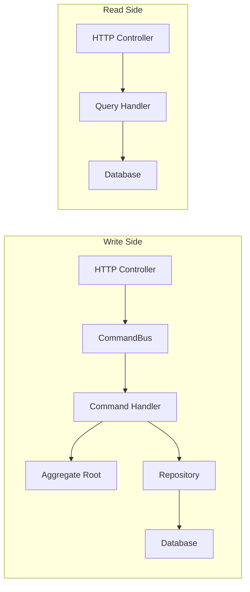
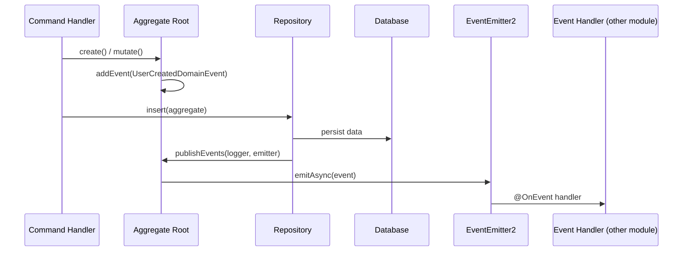

# CQRS and Events in NestJS

Command Query Responsibility Segregation (CQRS) separates read and write operations into distinct models. Combined with domain events, this creates a powerful pattern for complex NestJS applications.

## Table of Contents

- [CQRS Overview](#cqrs-overview)
- [Commands](#commands)
- [Queries](#queries)
- [Domain Event Flow](#domain-event-flow)
- [Integration Events](#integration-events)
- [Event Sourcing](#event-sourcing)

---

**See also:** [DDD-TACTICAL.md](DDD-TACTICAL.md) for domain event base class implementation, [HEXAGONAL-NESTJS.md](HEXAGONAL-NESTJS.md) for DI wiring of command/query handlers, [LAYERS.md](LAYERS.md) for how CQRS maps to the application layer.

---

## CQRS Overview



### Write side (Commands)

- Input goes through a **Command** object.
- A **Command Handler** orchestrates domain logic: creates/loads aggregates, invokes business methods, persists via repository.
- Uses the full domain model (entities, value objects, aggregates).
- Returns `Result<AggregateID, DomainError>` -- not the full entity.

### Read side (Queries)

- Input goes through a **Query** object.
- A **Query Handler** fetches data directly from the database.
- Can bypass the domain layer entirely -- no need for aggregates or repositories on reads.
- Returns read models (DTOs optimized for the consumer).

### When to use CQRS

CQRS adds a layer of indirection. Use it when the benefits outweigh the cost:

| Use CQRS                                                  | Skip CQRS                           |
| --------------------------------------------------------- | ----------------------------------- |
| Write model differs significantly from read model         | Read and write shapes are identical |
| Complex business rules on writes                          | Simple CRUD with validation         |
| Need to optimize reads independently (denormalized views) | One database, simple queries        |
| Multiple write entry points (HTTP, CLI, events)           | Single API consumer                 |

You can start with simple CQRS (separate command/query handlers sharing the same database) and evolve to separate read/write databases only if scaling demands it.

### NestJS CQRS Package

Install: `@nestjs/cqrs`

```typescript
import { Module } from '@nestjs/common';
import { CqrsModule } from '@nestjs/cqrs';

@Module({
  imports: [CqrsModule],
  // ...
})
export class UserModule {}
```

The `CqrsModule` provides `CommandBus`, `QueryBus`, and `EventBus`. Handlers are registered automatically when listed as providers in the module.

---

## Commands

A Command represents a user's intent to change state. It carries the data needed for the operation but does not execute it.

### Command Base Class

```typescript
// src/libs/ddd/command.base.ts

export class Command {
  /**
   * Metadata for tracing. Optionally set by the controller
   * or populated from request context.
   */
  readonly metadata?: {
    readonly correlationId?: string;
    readonly causationId?: string;
    readonly userId?: string;
    readonly timestamp?: number;
  };

  constructor(props?: Partial<Command>) {
    if (props?.metadata) {
      this.metadata = props.metadata;
    }
  }
}
```

### Concrete Command

```typescript
// src/modules/user/commands/create-user/create-user.command.ts

import { Command } from '@libs/ddd';

export interface CreateUserCommandProps {
  readonly email: string;
  readonly country: string;
  readonly postalCode: string;
  readonly street: string;
}

export class CreateUserCommand extends Command {
  readonly email: string;
  readonly country: string;
  readonly postalCode: string;
  readonly street: string;

  constructor(props: CreateUserCommandProps) {
    super(props);
    this.email = props.email;
    this.country = props.country;
    this.postalCode = props.postalCode;
    this.street = props.street;
  }
}
```

### Command Handler

The handler IS the use case. One handler per command, one command per use case.

```typescript
// src/modules/user/commands/create-user/create-user.service.ts

import { CommandHandler, ICommandHandler } from '@nestjs/cqrs';
import { Inject } from '@nestjs/common';
import { Err, Ok, Result } from 'oxide.ts';
import { AggregateID } from '@libs/ddd';
import { USER_REPOSITORY } from '../../user.di-tokens';
import { UserRepositoryPort } from '../../infrastructure/persistence/user.repository.port';
import { UserEntity } from '../../domain/user.entity';
import { Address } from '../../domain/value-objects/address.value-object';
import { UserAlreadyExistsError } from '../../domain/user.errors';
import { ConflictException } from '@libs/exceptions';
import { CreateUserCommand } from './create-user.command';

@CommandHandler(CreateUserCommand)
export class CreateUserService implements ICommandHandler {
  constructor(
    @Inject(USER_REPOSITORY)
    protected readonly userRepo: UserRepositoryPort,
  ) {}

  async execute(
    command: CreateUserCommand,
  ): Promise<Result<AggregateID, UserAlreadyExistsError>> {
    const user = UserEntity.create({
      email: command.email,
      address: new Address({
        country: command.country,
        postalCode: command.postalCode,
        street: command.street,
      }),
    });

    try {
      await this.userRepo.transaction(async () => this.userRepo.insert(user));
      return Ok(user.id);
    } catch (error: unknown) {
      if (error instanceof ConflictException) {
        return Err(new UserAlreadyExistsError(error));
      }
      throw error;
    }
  }
}
```

### Command Handler Rules

1. **Return `Result<T, E>`, not raw data.** Makes errors explicit in the type system.
2. **Wrap writes in a transaction.** The handler owns the transaction boundary.
3. **No HTTP concerns.** The handler doesn't know about status codes, request objects, or response formats.
4. **Avoid command-to-command chains.** Don't have one command handler execute another command. Use events instead: Command -> Event -> Command.
5. **Use the command bus for dispatching.** Controllers use `commandBus.execute(command)`, which decouples the controller from the handler.

> **@nestjs/cqrs v11 note:** `ICommandHandler` and `IQueryHandler` changed from interfaces to type aliases. Using `implements ICommandHandler` without generics (as shown above) still works. However, if you create abstract base handler classes with generic params like `implements ICommandHandler<TCommand, TResult>`, drop the `implements` clause and rely on structural typing instead -- TypeScript will still enforce the contract.

### Dispatching from a Controller

```typescript
@Controller('users')
export class CreateUserHttpController {
  constructor(private readonly commandBus: CommandBus) {}

  @Post()
  async create(@Body() body: CreateUserRequestDto): Promise<IdResponse> {
    const command = new CreateUserCommand(body);
    const result: Result<AggregateID, UserAlreadyExistsError> =
      await this.commandBus.execute(command);

    return match(result, {
      Ok: (id: string) => new IdResponse(id),
      Err: (error: Error) => {
        if (error instanceof UserAlreadyExistsError) {
          throw new ConflictHttpException(error.message);
        }
        throw error;
      },
    });
  }
}
```

---

## Queries

Queries retrieve data without side effects. They represent the read side of CQRS.

### Query Base Class

```typescript
// src/libs/ddd/query.base.ts

export abstract class Query {}
```

Queries are intentionally simple. Most carry pagination params and filter criteria.

### Concrete Query

```typescript
// src/modules/user/queries/find-users/find-users.query.ts

import { Query } from '@libs/ddd';

export interface FindUsersQueryProps {
  readonly limit: number;
  readonly page: number;
  readonly offset: number;
  readonly orderBy: { field: string; param: 'asc' | 'desc' };
  readonly country?: string;
  readonly postalCode?: string;
}

export class FindUsersQuery extends Query {
  readonly limit: number;
  readonly page: number;
  readonly offset: number;
  readonly orderBy: { field: string; param: 'asc' | 'desc' };
  readonly country?: string;
  readonly postalCode?: string;

  constructor(props: FindUsersQueryProps) {
    super();
    this.limit = props.limit;
    this.page = props.page;
    this.offset = props.offset;
    this.orderBy = props.orderBy;
    this.country = props.country;
    this.postalCode = props.postalCode;
  }
}
```

### Query Handler

Query handlers can skip the domain layer entirely and query the database directly. Reads don't mutate state, so the protections of aggregates and repositories aren't needed.

```typescript
// src/modules/user/queries/find-users/find-users.query-handler.ts

import { IQueryHandler, QueryHandler } from '@nestjs/cqrs';
import { PrismaService } from '@libs/db/prisma.service';
import { Paginated } from '@libs/ddd';
import { FindUsersQuery } from './find-users.query';

export interface UserReadModel {
  id: string;
  email: string;
  country: string;
  postalCode: string;
  street: string;
  role: string;
  createdAt: Date;
}

@QueryHandler(FindUsersQuery)
export class FindUsersQueryHandler implements IQueryHandler {
  constructor(private readonly prisma: PrismaService) {}

  async execute(query: FindUsersQuery): Promise<Paginated<UserReadModel>> {
    const where = {
      ...(query.country ? { country: query.country } : {}),
      ...(query.postalCode ? { postalCode: query.postalCode } : {}),
    };

    const [data, count] = await Promise.all([
      this.prisma.user.findMany({
        where,
        skip: query.offset,
        take: query.limit,
        orderBy: { [query.orderBy.field]: query.orderBy.param },
      }),
      this.prisma.user.count({ where }),
    ]);

    return new Paginated({
      data,
      count,
      limit: query.limit,
      page: query.page,
    });
  }
}
```

### Query Handler Rules

1. **No state mutations.** Queries are strictly read-only.
2. **Can use Prisma directly.** No repository abstraction needed for reads -- it adds complexity without benefit.
3. **Return read models, not domain entities.** The read model is a flat DTO optimized for the consumer.
4. **Keep it simple.** Query handlers are often just a thin wrapper around a database call.

### Pagination

```typescript
// src/libs/ddd/repository.port.ts (shared types)

export class Paginated<T> {
  readonly count: number;
  readonly limit: number;
  readonly page: number;
  readonly data: readonly T[];

  constructor(props: Paginated<T>) {
    this.count = props.count;
    this.limit = props.limit;
    this.page = props.page;
    this.data = props.data;
  }
}

export type OrderBy = { field: string; param: 'asc' | 'desc' };

export type PaginatedQueryParams = {
  limit: number;
  page: number;
  offset: number;
  orderBy: OrderBy;
};
```

---

## Domain Event Flow

Domain events enable decoupled communication between aggregates and modules. The flow works like this:



### Key Points

1. **Events are collected, not dispatched immediately.** The aggregate accumulates events via `addEvent()` during business method execution.
2. **Repository publishes events after persistence.** This ensures events are only emitted for changes that are actually saved.
3. **Use `@nestjs/event-emitter` v3+.** NestJS's `EventEmitter2` supports async handlers and wildcard subscriptions. v3 requires `@nestjs/common` ^10 || ^11.
4. **Domain events are the primary mechanism for cross-aggregate consistency.** When a command on one aggregate must trigger a rule on another, the first aggregate publishes an event and a subscriber coordinates the second aggregate in a separate transaction. See [AGGREGATE-DESIGN.md](AGGREGATE-DESIGN.md) for when to choose eventual consistency vs transactional consistency (the "ask whose job it is" heuristic).

### Publishing from the Repository

```typescript
// Inside repository base class, after a write operation:
async insert(entity: Aggregate | Aggregate[]): Promise<void> {
  const entities = Array.isArray(entity) ? entity : [entity];
  const records = entities.map(this.mapper.toPersistence);

  // Persist to database
  await this.prisma[this.modelName].createMany({ data: records });

  // Publish domain events after successful write
  await Promise.all(
    entities.map((e) => e.publishEvents(this.logger, this.eventEmitter)),
  );
}
```

### Writing Event Handlers

```typescript
import { OnEvent } from '@nestjs/event-emitter';
import { Inject, Injectable } from '@nestjs/common';

@Injectable()
export class CreateWalletWhenUserIsCreatedHandler {
  constructor(
    @Inject(WALLET_REPOSITORY)
    private readonly walletRepo: WalletRepositoryPort,
  ) {}

  @OnEvent(UserCreatedDomainEvent.name, { async: true, promisify: true })
  async handle(event: UserCreatedDomainEvent): Promise<void> {
    const wallet = WalletEntity.create({ userId: event.aggregateId });
    await this.walletRepo.insert(wallet);
  }
}
```

### Transaction Wrapping

When a command handler publishes domain events that trigger side effects (creating a wallet when a user is created), you often want everything in a single transaction:

```typescript
@CommandHandler(CreateUserCommand)
export class CreateUserService implements ICommandHandler {
  async execute(
    command: CreateUserCommand,
  ): Promise<Result<AggregateID, UserAlreadyExistsError>> {
    const user = UserEntity.create({
      /* ... */
    });

    try {
      // The transaction wraps both the insert AND any event handler side effects
      await this.userRepo.transaction(async () => {
        await this.userRepo.insert(user);
        // Domain events fire here (inside the transaction).
        // If the wallet creation fails, the user insert also rolls back.
      });
      return Ok(user.id);
    } catch (error: unknown) {
      if (error instanceof ConflictException) {
        return Err(new UserAlreadyExistsError(error));
      }
      throw error;
    }
  }
}
```

### Pitfall: Long Event Chains

Avoid designs where events trigger events trigger events:

```
CreateUser -> UserCreated -> CreateWallet -> WalletCreated -> SendWelcomeEmail -> ...
```

This becomes impossible to trace and debug. When a workflow has many steps, consider:

- **Orchestration:** A single service/saga that coordinates the steps explicitly.
- **Process Manager:** A stateful handler that tracks workflow progress.
- **Limit depth:** One level of event handling is usually enough. If a handler needs to do multiple things, do them in the handler rather than emitting more events.

---

## Integration Events

Integration events communicate between processes (microservices, external systems). They differ from domain events in scope and delivery guarantees.

### When to Use

A domain event handler should publish an integration event when the side effect is:

- Sending a message to another microservice.
- Calling an external API.
- Publishing to a message broker (RabbitMQ, Kafka, SQS).

### Outbox Pattern

For reliable integration event delivery, use the transactional outbox pattern:

1. When persisting domain changes, also write the integration event to an `outbox` table in the same transaction.
2. A background process polls the outbox table and publishes events to the message broker.
3. After successful publication, mark the outbox entry as processed.

```typescript
// Conceptual implementation
interface OutboxEntry {
  id: string;
  eventType: string;
  payload: string; // JSON serialized
  createdAt: Date;
  processedAt?: Date;
}

// Inside a domain event handler:
@OnEvent(UserCreatedDomainEvent.name, { async: true, promisify: true })
async handle(event: UserCreatedDomainEvent): Promise<void> {
  // Write integration event to outbox (same transaction as the domain change)
  await this.outboxRepo.insert({
    id: randomUUID(),
    eventType: 'user.created',
    payload: JSON.stringify({
      userId: event.aggregateId,
      email: event.email,
      occurredAt: event.metadata.timestamp,
    }),
    createdAt: new Date(),
  });
}
```

```typescript
// Background worker (cron job or polling):
@Injectable()
export class OutboxProcessor {
  @Cron('*/5 * * * * *') // Every 5 seconds
  async processOutbox(): Promise<void> {
    const entries = await this.outboxRepo.findUnprocessed({ limit: 100 });

    for (const entry of entries) {
      await this.messageBroker.publish(entry.eventType, entry.payload);
      await this.outboxRepo.markProcessed(entry.id);
    }
  }
}
```

The outbox guarantees at-least-once delivery. Consumers must be idempotent -- they should handle receiving the same event multiple times gracefully.

### Integration Event Naming

Use a different naming convention from domain events to make the distinction clear:

- Domain event: `UserCreatedDomainEvent` (class name, PascalCase)
- Integration event topic: `user.created` (dot notation, lowercase)

---

## Event Sourcing

Event Sourcing stores the sequence of events that led to the current state, rather than storing the state itself. The current state is derived by replaying events.

### When to Consider

Most applications do **not** need event sourcing. Consider it only when:

- A complete audit trail is a core business requirement (financial systems, compliance).
- You need to reconstruct past states ("what did this order look like last Tuesday?").
- Temporal queries are a primary use case.

### When to Skip

- The added complexity is significant (event versioning, snapshotting, eventual consistency).
- Simple CRUD with an audit log table usually suffices for compliance needs.
- Event sourcing can be introduced later without changing the domain model -- the aggregate interface stays the same.

### Compatibility

The architecture described in this skill is compatible with event sourcing because:

- Aggregates already collect domain events via `addEvent()`.
- The repository port interface abstracts persistence -- swapping a CRUD store for an event store doesn't change the domain layer.
- CQRS is already in place, making it natural to project events into read models.

If you need event sourcing, replace the repository implementation with an event store adapter. The domain layer and application layer remain unchanged.
