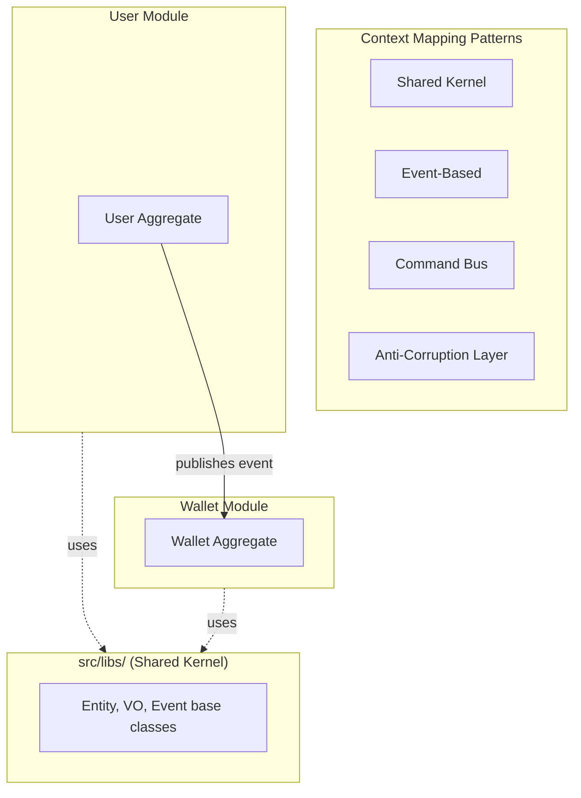

# DDD Strategic Patterns in NestJS

Strategic DDD is about decomposing a system into well-bounded pieces and defining how those pieces communicate. In NestJS, the natural boundary is the `@Module()`.

## Table of Contents

- [NestJS Module as Bounded Context](#nestjs-module-as-bounded-context)
- [Ubiquitous Language](#ubiquitous-language)
- [Context Mapping](#context-mapping)
- [Subdomain Classification](#subdomain-classification)

---

**See also:** [DDD-TACTICAL.md](DDD-TACTICAL.md) for building block implementations within each context, [CQRS-EVENTS.md](CQRS-EVENTS.md) for event-based communication between contexts, [LAYERS.md](LAYERS.md) for the layer architecture.

---

## NestJS Module as Bounded Context

A Bounded Context is a semantic boundary within which a particular domain model is defined and consistent. In NestJS, each `@Module()` naturally maps to one bounded context.

### Module encapsulation

NestJS providers are private by default. Only providers listed in the `exports` array are visible to other modules. This is the enforcement mechanism for bounded context boundaries.

```typescript
@Module({
  imports: [CqrsModule],
  controllers: [CreateUserHttpController, FindUsersHttpController],
  providers: [
    { provide: USER_REPOSITORY, useClass: UserRepository },
    UserMapper,
    CreateUserService,
    FindUsersQueryHandler,
  ],
  // Only expose what other modules genuinely need
  exports: [],
})
export class UserModule {}
```

In this example, nothing is exported. The User module is fully self-contained -- other modules interact with it through domain events or the command bus, not by importing its internal providers.

### When to export

Export a provider only when:

- Another module has a legitimate need to use it (e.g., a shared domain service).
- You're exposing a port interface for cross-module coordination.
- You're building a shared infrastructure module (like `PrismaModule` with `@Global()`).

Avoid exporting repositories, entities, or internal services. If another module needs data from this module, create a query via the `QueryBus` or communicate through events.

### Module facade pattern

If a module does need to expose functionality, create an explicit facade rather than leaking internals:

```typescript
// src/modules/user/user-facade.service.ts

@Injectable()
export class UserFacadeService {
  constructor(private readonly queryBus: QueryBus) {}

  async findUserById(id: string): Promise<UserReadModel | undefined> {
    return this.queryBus.execute(new FindUserByIdQuery({ id }));
  }
}
```

```typescript
@Module({
  // ...
  exports: [UserFacadeService],
})
export class UserModule {}
```

This keeps the public surface area small and explicit. Internal refactoring of the User module won't break consumers.

### Module size heuristic

If a module grows beyond ~15-20 providers, consider whether it covers more than one subdomain. Signs that a module needs splitting:

- Two groups of entities that rarely interact in the same use case.
- Developers working on different features within the module frequently conflict.
- The module has more than 5-6 aggregates.
- Different parts of the module have different rates of change.

### `forRoot()` / `forFeature()` patterns

For shared infrastructure modules that need configuration:

```typescript
@Global()
@Module({})
export class PrismaModule {
  static forRoot(options: PrismaModuleOptions): DynamicModule {
    return {
      module: PrismaModule,
      providers: [
        {
          provide: PrismaService,
          useFactory: () => {
            const prisma = new PrismaService(options);
            return prisma;
          },
        },
      ],
      exports: [PrismaService],
    };
  }
}
```

Use `@Global()` sparingly -- only for truly universal infrastructure like database connections or logging.

---

## Ubiquitous Language

The domain model should speak the language of the business, not the language of the technology. This starts with naming.

### File naming

File names should reflect domain concepts. The suffix (`.entity.ts`, `.value-object.ts`) communicates the DDD building block type.

```
# Good -- names reflect business domain
user.entity.ts
address.value-object.ts
user-created.domain-event.ts
create-user.command.ts

# Bad -- names reflect technology or are too generic
user-table.entity.ts
user-data.model.ts
user-event.ts
user-handler.ts
```

### Type naming

Domain layer types should use business language. Technical names belong in infrastructure.

```typescript
// Good -- domain types match business concepts
interface UserProps {
  email: string;
  role: UserRoles;
  address: Address;
}

// Bad -- domain types reveal infrastructure
interface UserRow {
  email_address: string;
  user_role_id: number;
  address_json: string;
}
```

Infrastructure types (Prisma models, DB schemas) can and should use technical names. The mapper bridges between the two vocabularies.

### Naming consistency rules

Within a bounded context:

1. **Same concept, same name.** If the business calls it an "Order", don't call it a "Purchase" in code and a "Transaction" in the database.
2. **Different contexts, different names are fine.** "Customer" in the Sales context and "User" in the Auth context can refer to the same person -- that's expected at context boundaries.
3. **Domain layer dictates naming.** Infrastructure and presentation layers adapt to the domain vocabulary, not the other way around.

---

## Context Mapping

Context mapping defines how bounded contexts (modules) relate to and communicate with each other.

### Communication Patterns



### Shared Kernel

The `src/libs/` directory is the shared kernel -- code that all bounded contexts depend on. Keep it minimal:

- DDD base classes (`Entity`, `AggregateRoot`, `ValueObject`, `DomainEvent`)
- Shared port interfaces (`LoggerPort`)
- Common exception classes
- Utility types and helpers

The shared kernel should be stable and change infrequently. If something in `libs/` changes often, it probably belongs in a specific module instead.

### Event-Based Integration

The primary pattern for inter-module communication. One module publishes a domain event; another module subscribes and reacts.

```typescript
// User module publishes UserCreatedDomainEvent (via aggregate + repository)

// Wallet module handles it:
@Injectable()
export class CreateWalletWhenUserIsCreatedHandler {
  constructor(
    @Inject(WALLET_REPOSITORY)
    private readonly walletRepo: WalletRepositoryPort,
  ) {}

  @OnEvent(UserCreatedDomainEvent.name, { async: true, promisify: true })
  async handle(event: UserCreatedDomainEvent): Promise<void> {
    const wallet = WalletEntity.create({ userId: event.aggregateId });
    await this.walletRepo.insert(wallet);
  }
}
```

Benefits:

- Modules don't import each other's internals.
- Adding new reactions to an event requires zero changes to the publishing module.
- Modules can be extracted to microservices later by replacing in-memory events with a message broker.

Risks:

- Long event chains become hard to trace (Event A -> Handler -> Event B -> Handler -> Event C). When workflows get complex, consider an explicit orchestrator/saga instead of pure event choreography.

### Command Bus Integration

For request/response communication across modules (when you need a result back):

```typescript
// From Order module, requesting user data:
const user = await this.queryBus.execute(
  new FindUserByIdQuery({ id: order.userId }),
);
```

This works because NestJS CQRS registers handlers globally. The Order module doesn't need to import `UserModule` -- it just dispatches a query that the User module's handler picks up.

### Anti-Corruption Layer (ACL)

When integrating with an external system or a legacy module whose model doesn't match yours, create an adapter that translates between vocabularies:

```typescript
// src/modules/billing/infrastructure/stripe-payment.adapter.ts

import { Injectable } from '@nestjs/common';
import { PaymentPort } from '../domain/payment.port';
import { Payment } from '../domain/payment.entity';

@Injectable()
export class StripePaymentAdapter implements PaymentPort {
  constructor(private readonly stripeClient: StripeClient) {}

  async charge(payment: Payment): Promise<string> {
    // Translate from our domain model to Stripe's API model
    const stripeCharge = await this.stripeClient.charges.create({
      amount: payment.amount.toCents(),
      currency: payment.currency.value,
      source: payment.paymentMethodId,
      description: payment.description,
    });
    return stripeCharge.id;
  }
}
```

The ACL ensures that external API changes or legacy model quirks don't leak into your domain.

### What to avoid

**Direct imports between modules:**

```typescript
// BAD -- Order module directly importing User module internals
import { UserEntity } from '@modules/user/domain/user.entity';
import { UserRepository } from '@modules/user/database/user.repository';

// GOOD -- Reference by ID, communicate through events/queries
interface OrderProps {
  userId: string; // Reference by ID, not by object
}
```

**Circular dependencies between modules:**

If Module A depends on Module B and Module B depends on Module A, you have a design problem. Solutions:

- Extract the shared concept into a third module.
- Replace one direction with event-based communication.
- Merge the modules if they're truly one bounded context.

---

## Subdomain Classification

Not every part of your system deserves the full DDD treatment. Classify subdomains to allocate architectural effort proportionally.

### Core Domain

Your competitive advantage. The part of the system that makes your business unique.

- Full DDD: rich entities, value objects, aggregates, domain events.
- Maximum test coverage.
- Domain experts actively involved in modeling.
- This is where the architecture described in this skill pays off the most.

**Example:** For an e-commerce platform, the product catalog + pricing engine might be core.

### Supporting Domain

Necessary for the business to operate but not a differentiator. It supports the core domain.

- Simplified DDD: entities and basic services, possibly without full CQRS.
- Good test coverage but less investment in modeling sessions.
- Can use simpler patterns (plain services instead of command handlers).

**Example:** User management, notification preferences.

### Generic Domain

Solved problems. Use off-the-shelf solutions.

- No custom DDD -- use existing libraries, SaaS products, or well-known patterns.
- Authentication (Passport.js, Auth0), file storage (S3), email sending (SendGrid).
- Wrap in an adapter if needed to keep your domain clean.

**Example:** Authentication, file upload, logging infrastructure.

### Deciding classification

Ask these questions about each part of your system:

| Question                                      | Core       | Supporting   | Generic |
| --------------------------------------------- | ---------- | ------------ | ------- |
| Does this differentiate us from competitors?  | Yes        | No           | No      |
| Do we need deep domain expertise to build it? | Yes        | Sometimes    | No      |
| Would buying this off-the-shelf work?         | No         | Maybe        | Yes     |
| How often does this logic change?             | Frequently | Occasionally | Rarely  |
| What's the cost of getting this wrong?        | High       | Medium       | Low     |

The classification isn't permanent. A supporting domain can become core if the business pivots. Reassess periodically.
