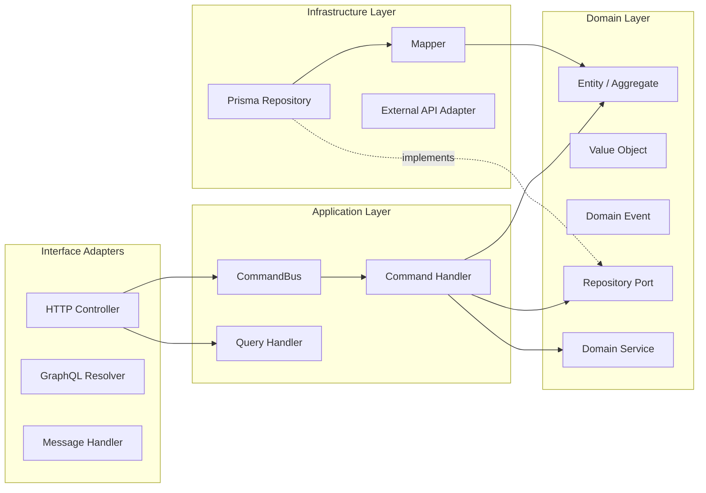

# Layer Architecture in NestJS

This document specifies the four layers of the architecture, what belongs in each, and how they connect in a NestJS application.

## Table of Contents

- [Dependency Flow](#dependency-flow)
- [Domain Layer](#domain-layer)
- [Application Layer](#application-layer)
- [Infrastructure Layer](#infrastructure-layer)
- [Interface Adapters (Presentation Layer)](#interface-adapters-presentation-layer)
- [Composition Root](#composition-root)
- [Shared Libraries](#shared-libraries)

## Dependency Flow



**The rule is simple:** arrows point inward. Domain knows nothing about the layers around it. Application depends on Domain. Infrastructure and Interface Adapters depend on Application and Domain, but never the reverse.

---

**See also:** [DDD-TACTICAL.md](DDD-TACTICAL.md) for building block implementations, [DDD-STRATEGIC.md](DDD-STRATEGIC.md) for module boundary design, [CQRS-EVENTS.md](CQRS-EVENTS.md) for command/query patterns, [HEXAGONAL-NESTJS.md](HEXAGONAL-NESTJS.md) for ports/adapters wiring.

---

## Domain Layer

The innermost layer. Contains all business rules and domain logic. Has **zero** dependencies on NestJS framework code, Prisma, HTTP libraries, or any external infrastructure.

### What belongs here

- **Entities and Aggregate Roots** -- objects with identity and business behavior
- **Value Objects** -- immutable objects defined by their attributes
- **Domain Events** -- records of something that happened in the domain
- **Domain Services** -- stateless logic spanning multiple entities
- **Domain Errors** -- business rule violation error types
- **Repository Ports** -- interfaces defining persistence contracts (not implementations)

### Rules

1. **No NestJS imports.** No `@Injectable()`, no `@Inject()`, no NestJS modules. Domain classes are plain TypeScript.
2. **No infrastructure imports.** No Prisma, no database drivers, no HTTP clients, no message brokers.
3. **No randomness or I/O.** ID generation (e.g., `randomUUID()`) is acceptable in entity factory methods. Everything else goes through ports.
4. **Rich behavior.** Entities contain the business logic, not just data. Avoid anemic models where services hold all the logic.
5. **Self-validating.** Entities and value objects enforce their own invariants. An invalid domain object should not be constructable.

### File conventions

```
modules/{module}/domain/
├── {entity}.entity.ts           # Aggregate root or child entity
├── {entity}.types.ts            # Props interfaces, enums, type aliases
├── {entity}.errors.ts           # Domain error classes
├── value-objects/
│   └── {vo}.value-object.ts     # Value objects
└── events/
    └── {name}.domain-event.ts   # Domain events
```

### Example: Domain entity

```typescript
import { AggregateRoot, AggregateID } from '@libs/ddd';
import { UserCreatedDomainEvent } from './events/user-created.domain-event';
import { Address } from './value-objects/address.value-object';
import { CreateUserProps, UserProps, UserRoles } from './user.types';
import { randomUUID } from 'crypto';

export class UserEntity extends AggregateRoot<UserProps> {
  protected readonly _id: AggregateID;

  static create(create: CreateUserProps): UserEntity {
    const id = randomUUID();
    const props: UserProps = { ...create, role: UserRoles.guest };
    const user = new UserEntity({ id, props });
    user.addEvent(
      new UserCreatedDomainEvent({
        aggregateId: id,
        email: props.email,
        ...props.address.unpack(),
      }),
    );
    return user;
  }

  get role(): UserRoles {
    return this.props.role;
  }

  makeAdmin(): void {
    this.props.role = UserRoles.admin;
  }

  validate(): void {
    // Enforce aggregate invariants here
  }
}
```

Notice: no decorators, no framework imports. This class is testable with plain TypeScript -- no DI container needed.

---

## Application Layer

Orchestrates use cases by coordinating domain objects and infrastructure through ports. This is where commands and queries live.

### What belongs here

- **Command Handlers** -- execute state-changing use cases (create, update, delete)
- **Query Handlers** -- execute read-only use cases
- **Commands and Queries** -- DTOs that describe what the user wants to do
- **Port Definitions** -- interfaces for driven adapters (when not co-located with domain)
- **Event Handlers** -- react to domain events for cross-aggregate side effects

### Rules

1. **NestJS CQRS decorators are allowed.** `@CommandHandler()`, `@QueryHandler()`, `@Inject()` live here.
2. **Depends on Domain, never on Infrastructure.** Handlers reference repository ports, not Prisma repositories.
3. **One handler per use case.** Each command or query gets its own handler. Avoid monolithic services.
4. **Transaction boundary.** Handlers are responsible for wrapping domain operations in transactions.
5. **No HTTP concerns.** Handlers don't know about request/response formats, status codes, or headers.

> **@nestjs/cqrs v11:** `ICommandHandler` and `IQueryHandler` are now type aliases instead of interfaces. `implements ICommandHandler` without generics still works. If you build abstract base handler classes with generic params, drop the `implements` clause and let structural typing enforce the contract.

### File conventions

```
modules/{module}/
├── commands/
│   └── {use-case}/
│       ├── {use-case}.command.ts       # Command DTO
│       ├── {use-case}.service.ts       # Command handler implementation
│       ├── {use-case}.http.controller.ts
│       └── {use-case}.request.dto.ts
├── queries/
│   └── {query}/
│       ├── {query}.query-handler.ts    # Query handler implementation
│       ├── {query}.http.controller.ts
│       └── {query}.request.dto.ts
└── application/
    └── event-handlers/                 # Domain event handlers (cross-module reactions)
        └── {handler}.domain-event-handler.ts
```

### Example: Command handler

```typescript
import { CommandHandler, ICommandHandler } from '@nestjs/cqrs';
import { Inject } from '@nestjs/common';
import { Err, Ok, Result } from 'oxide.ts';
import { AggregateID } from '@libs/ddd';
import { USER_REPOSITORY } from '../../user.di-tokens';
import { UserRepositoryPort } from '../../database/user.repository.port';
import { UserEntity } from '../../domain/user.entity';
import { Address } from '../../domain/value-objects/address.value-object';
import { UserAlreadyExistsError } from '../../domain/user.errors';
import { ConflictException } from '@libs/exceptions';
import { CreateUserCommand } from './create-user.command';

@CommandHandler(CreateUserCommand)
export class CreateUserService implements ICommandHandler {
  constructor(
    @Inject(USER_REPOSITORY)
    protected readonly userRepo: UserRepositoryPort,
  ) {}

  async execute(
    command: CreateUserCommand,
  ): Promise<Result<AggregateID, UserAlreadyExistsError>> {
    const user = UserEntity.create({
      email: command.email,
      address: new Address({
        country: command.country,
        postalCode: command.postalCode,
        street: command.street,
      }),
    });

    try {
      await this.userRepo.transaction(async () => this.userRepo.insert(user));
      return Ok(user.id);
    } catch (error: unknown) {
      if (error instanceof ConflictException) {
        return Err(new UserAlreadyExistsError(error));
      }
      throw error;
    }
  }
}
```

Key points: the handler depends on `UserRepositoryPort` (an interface), not a concrete Prisma class. It uses `@Inject(USER_REPOSITORY)` with a DI token. The transaction boundary is here, not in the repository.

### Example: Query handler

```typescript
import { IQueryHandler, QueryHandler } from '@nestjs/cqrs';
import { Inject } from '@nestjs/common';
import { PrismaService } from '@libs/db/prisma.service';
import { Paginated } from '@libs/ddd';
import { FindUsersQuery } from './find-users.query';

@QueryHandler(FindUsersQuery)
export class FindUsersQueryHandler implements IQueryHandler {
  constructor(private readonly prisma: PrismaService) {}

  async execute(query: FindUsersQuery): Promise<Paginated<UserReadModel>> {
    const [data, count] = await Promise.all([
      this.prisma.user.findMany({
        where: query.filters,
        skip: query.offset,
        take: query.limit,
        orderBy: { [query.orderBy.field]: query.orderBy.param },
      }),
      this.prisma.user.count({ where: query.filters }),
    ]);

    return new Paginated({ data, count, limit: query.limit, page: query.page });
  }
}
```

Query handlers can bypass the domain layer entirely and query the database directly. Reads don't need to go through aggregates or repositories because they don't mutate state.

---

## Infrastructure Layer

Implements the ports defined by the domain and application layers. This is where technology-specific code lives.

### What belongs here

- **Repository Implementations** -- Prisma adapters implementing repository ports
- **Mappers** -- translate between domain entities and persistence models
- **External API Adapters** -- HTTP clients, message broker publishers/consumers
- **Framework Configuration** -- Prisma module, database config, logger implementation
- **Persistence Models** -- Prisma schema, Zod schemas for runtime validation

### Rules

1. **Implements ports, never invoked directly.** Code outside infrastructure references the port interface, not the adapter.
2. **Contains all technology coupling.** If you need to swap Prisma for another ORM, only this layer changes.
3. **Mapper required.** Domain entities are not the same shape as database records. Always map between the two.
4. **Domain events published after persistence.** The repository publishes accumulated domain events only after a successful write.

### File conventions

```
modules/{module}/
├── database/
│   ├── {entity}.repository.port.ts    # Interface (belongs conceptually to domain)
│   └── {entity}.repository.ts         # Prisma implementation
├── {module}.mapper.ts                 # Domain <-> Persistence mapper
└── infrastructure/                    # Optional: other adapters
    ├── {service}.adapter.ts
    └── {service}.port.ts
```

### Example: Repository implementation

```typescript
import { Injectable, Inject } from '@nestjs/common';
import { EventEmitter2 } from '@nestjs/event-emitter';
import { PrismaService } from '@libs/db/prisma.service';
import { PrismaRepositoryBase } from '@libs/db/prisma-repository.base';
import { UserEntity } from '../domain/user.entity';
import { UserMapper } from '../user.mapper';
import { UserRepositoryPort } from './user.repository.port';
import { LoggerPort } from '@libs/ports/logger.port';
import { USER_LOGGER } from '../user.di-tokens';

@Injectable()
export class UserRepository
  extends PrismaRepositoryBase<UserEntity>
  implements UserRepositoryPort
{
  constructor(
    prisma: PrismaService,
    mapper: UserMapper,
    eventEmitter: EventEmitter2,
    @Inject(USER_LOGGER) logger: LoggerPort,
  ) {
    super(prisma, mapper, eventEmitter, logger, 'user');
  }

  async findOneByEmail(email: string): Promise<UserEntity | undefined> {
    const record = await this.prisma.user.findUnique({ where: { email } });
    return record ? this.mapper.toDomain(record) : undefined;
  }
}
```

---

## Interface Adapters (Presentation Layer)

The outermost layer. Handles user-facing I/O: HTTP requests, GraphQL queries, CLI commands, message consumption. Translates between external formats and the application layer's command/query objects.

### What belongs here

- **Controllers** -- NestJS `@Controller()` classes handling HTTP routes
- **GraphQL Resolvers** -- `@Resolver()` classes
- **Message Controllers** -- microservice event/message handlers
- **Request DTOs** -- input validation with `class-validator` decorators
- **Response DTOs** -- output serialization with `@nestjs/swagger` decorators

### Rules

1. **Thin controllers.** Parse input, dispatch to command/query bus, map result to response. No business logic.
2. **One controller per use case.** Keeps controllers small and focused.
3. **Validation at the boundary.** Use `class-validator` on request DTOs to reject malformed input before it reaches the domain.
4. **Error mapping here.** Convert domain errors to HTTP status codes in the controller, not in the domain.

> **Express v5 (NestJS v11+):** Wildcard routes must now use named parameters. Use `@Get('files/{*splat}')` instead of `@Get('files/*')`. The optional character `?` is no longer supported in route paths -- use braces `{param}` instead. Standard routes like `@Get(':id')`, `@Post()`, `@Delete(':id')` are unaffected.

### File conventions

Controllers co-locate with their command/query:

```
modules/{module}/commands/{use-case}/
├── {use-case}.http.controller.ts      # HTTP entry point
├── {use-case}.message.controller.ts   # Message broker entry point (optional)
├── {use-case}.request.dto.ts          # Request validation DTO
└── ...

modules/{module}/dtos/
└── {entity}.response.dto.ts           # Shared response DTOs
```

### Example: HTTP controller

```typescript
import { Body, Controller, HttpStatus, Post } from '@nestjs/common';
import { CommandBus } from '@nestjs/cqrs';
import { ApiOperation, ApiResponse } from '@nestjs/swagger';
import { match, Result } from 'oxide.ts';
import { IdResponse } from '@libs/api/id.response.dto';
import { AggregateID } from '@libs/ddd';
import { CreateUserCommand } from './create-user.command';
import { CreateUserRequestDto } from './create-user.request.dto';
import { UserAlreadyExistsError } from '../../domain/user.errors';
import { ConflictHttpException } from '@libs/exceptions';

@Controller('users')
export class CreateUserHttpController {
  constructor(private readonly commandBus: CommandBus) {}

  @Post()
  @ApiOperation({ summary: 'Create a user' })
  @ApiResponse({ status: HttpStatus.CREATED, type: IdResponse })
  @ApiResponse({ status: HttpStatus.CONFLICT })
  async create(@Body() body: CreateUserRequestDto): Promise<IdResponse> {
    const command = new CreateUserCommand(body);

    const result: Result<AggregateID, UserAlreadyExistsError> =
      await this.commandBus.execute(command);

    return match(result, {
      Ok: (id: string) => new IdResponse(id),
      Err: (error: Error) => {
        if (error instanceof UserAlreadyExistsError) {
          throw new ConflictHttpException(error.message);
        }
        throw error;
      },
    });
  }
}
```

The controller's only job: parse the request DTO, build a command, dispatch it, and map the result to an HTTP response. All business logic lives deeper in the stack.

---

## Composition Root

The NestJS `@Module()` decorator serves as the **composition root** -- the single place where all dependencies are wired together.

### DI Token Pattern

Define injection tokens as Symbols in a dedicated file. This decouples consumers from concrete implementations.

```typescript
// user.di-tokens.ts
export const USER_REPOSITORY = Symbol('USER_REPOSITORY');
```

### Module Wiring

```typescript
import { Module } from '@nestjs/common';
import { CqrsModule } from '@nestjs/cqrs';
import { USER_REPOSITORY } from './user.di-tokens';
import { UserRepository } from './database/user.repository';
import { UserMapper } from './user.mapper';
import { CreateUserService } from './commands/create-user/create-user.service';
import { CreateUserHttpController } from './commands/create-user/create-user.http.controller';
import { FindUsersQueryHandler } from './queries/find-users/find-users.query-handler';
import { FindUsersHttpController } from './queries/find-users/find-users.http.controller';
import { DeleteUserService } from './commands/delete-user/delete-user.service';
import { DeleteUserHttpController } from './commands/delete-user/delete-user.http-controller';

@Module({
  imports: [CqrsModule],
  controllers: [
    CreateUserHttpController,
    FindUsersHttpController,
    DeleteUserHttpController,
  ],
  providers: [
    // Adapter binding: token -> concrete implementation
    { provide: USER_REPOSITORY, useClass: UserRepository },

    // Mapper (no token needed -- single implementation)
    UserMapper,

    // Command handlers
    CreateUserService,
    DeleteUserService,

    // Query handlers
    FindUsersQueryHandler,
  ],
})
export class UserModule {}
```

### Why tokens matter

- **Testability:** In tests, swap `{ provide: USER_REPOSITORY, useClass: InMemoryUserRepository }`.
- **Flexibility:** Change the persistence adapter without touching any handler code.
- **Explicitness:** The module file is the single source of truth for what is wired to what.

### Swapping adapters per environment

```typescript
const repositoryProvider = {
  provide: USER_REPOSITORY,
  useClass:
    process.env.NODE_ENV === 'test' ? InMemoryUserRepository : UserRepository,
};
```

Or use `ConfigModule` and a factory provider for more sophisticated switching.

---

## Shared Libraries

The `src/libs/` directory contains base classes and utilities shared across all modules. This is the **shared kernel** in DDD terms.

```
src/libs/
├── ddd/
│   ├── entity.base.ts            # Abstract Entity<Props> base
│   ├── aggregate-root.base.ts    # AggregateRoot extending Entity (adds domain events)
│   ├── value-object.base.ts      # Abstract ValueObject<T> base
│   ├── domain-event.base.ts      # DomainEvent base with metadata
│   ├── command.base.ts           # Command base class
│   ├── query.base.ts             # Query base class
│   ├── repository.port.ts        # Generic RepositoryPort<Entity> interface
│   ├── mapper.interface.ts       # Mapper<DomainEntity, DbRecord> interface
│   └── index.ts                  # Barrel export
├── db/
│   ├── prisma.service.ts         # PrismaService (extends PrismaClient)
│   └── prisma-repository.base.ts # Abstract Prisma repository base
├── api/
│   ├── id.response.dto.ts        # Generic ID response
│   ├── paginated-query.request.dto.ts
│   ├── paginated.response.base.ts
│   └── interceptors/
│       └── exception.interceptor.ts
├── ports/
│   └── logger.port.ts            # LoggerPort interface
├── exceptions/
│   ├── exception.base.ts         # Base exception with serialization
│   └── exception.codes.ts        # Standard error codes
└── types/
    └── index.ts                  # Shared utility types
```

### Key principle

Anything in `libs/` must be genuinely shared (used by 2+ modules). Module-specific code stays in the module, even if it looks reusable. Premature extraction into `libs/` creates hidden coupling.
