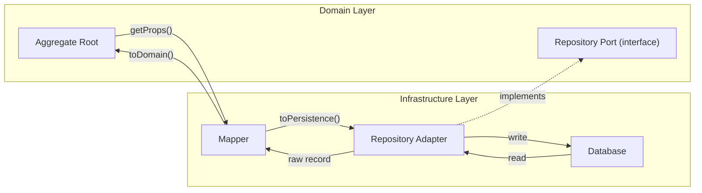
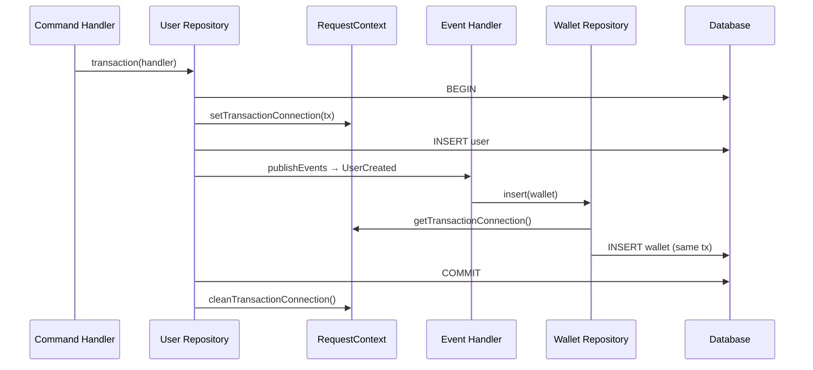

# Persistence Patterns (ORM-Agnostic)

This document defines the contracts and patterns that any persistence adapter must follow. It is intentionally decoupled from any specific ORM so that Prisma, TypeORM, Drizzle, MikroORM, Slonik, or any other database library can implement these patterns without changing the domain or application layers.

## Table of Contents

- [Persistence Layer Architecture](#persistence-layer-architecture)
- [Generic Repository Port](#generic-repository-port)
- [Mapper Interface](#mapper-interface)
- [Base Repository Contract](#base-repository-contract)
- [Transaction Management](#transaction-management)
- [Adding a New ORM Adapter](#adding-a-new-orm-adapter)

---

**See also:** [PRISMA-ADAPTER.md](PRISMA-ADAPTER.md) for the concrete Prisma implementation of these patterns, [HEXAGONAL-NESTJS.md](HEXAGONAL-NESTJS.md) for the ports/adapters wiring that connects these patterns to NestJS DI.

---

## Persistence Layer Architecture

The persistence layer sits in the infrastructure ring of the hexagonal architecture. Its sole job is translating between the domain model and the database, hiding all technology-specific details behind port interfaces.



### Core Principle: Domain Model != Persistence Model

The domain model is shaped for business logic -- rich entities with value objects, encapsulated behavior, and invariant enforcement. The persistence model is shaped for the database -- flat records, foreign keys, and column types.

These two shapes should never be forced to match. The mapper bridges the gap, so changes to the database schema don't ripple into domain logic and vice versa.

| Concern       | Domain Model                         | Persistence Model                       |
| ------------- | ------------------------------------ | --------------------------------------- |
| Shape         | Rich objects, nested value objects   | Flat records, primitive columns         |
| Identity      | `AggregateID` (UUID string)          | Primary key (UUID, serial, etc.)        |
| Enums         | TypeScript enums (`UserRoles.admin`) | Database enums or strings (`'ADMIN'`)   |
| Relationships | Reference by ID (`userId: string`)   | Foreign keys, joins                     |
| Validation    | Invariants in entity/VO constructors | Database constraints (unique, not null) |
| Timestamps    | `Date` objects                       | Database-native datetime types          |

---

## Generic Repository Port

The base interface that every aggregate's repository must satisfy. Module-specific repositories extend this with domain-specific query methods.

```typescript
// src/libs/ddd/repository.port.ts

export class Paginated<T> {
  readonly count: number;
  readonly limit: number;
  readonly page: number;
  readonly data: readonly T[];

  constructor(props: Paginated<T>) {
    this.count = props.count;
    this.limit = props.limit;
    this.page = props.page;
    this.data = props.data;
  }
}

export type OrderBy = { field: string; param: 'asc' | 'desc' };

export type PaginatedQueryParams = {
  limit: number;
  page: number;
  offset: number;
  orderBy: OrderBy;
};

export interface RepositoryPort<Entity> {
  insert(entity: Entity | Entity[]): Promise<void>;
  findOneById(id: string): Promise<Entity | undefined>;
  findAll(): Promise<Entity[]>;
  findAllPaginated(params: PaginatedQueryParams): Promise<Paginated<Entity>>;
  delete(entity: Entity): Promise<boolean>;

  /**
   * Wraps the given handler in a database transaction.
   * If the handler throws, the transaction rolls back.
   */
  transaction<T>(handler: () => Promise<T>): Promise<T>;
}
```

### Design Decisions

**`findOneById` returns `Entity | undefined`, not `Option<Entity>`.**
Using `undefined` for absent values is idiomatic TypeScript and avoids coupling the port to a specific Result/Option library. If you prefer `oxide.ts` Option types, you can adopt that convention -- just be consistent across all ports.

**One repository per aggregate, not per entity.**
A `UserRepository` manages the `UserEntity` aggregate root and all its child entities/value objects. There is no separate `AddressRepository` -- the address is persisted as part of the user aggregate.

**`transaction()` lives on the port.**
The command handler calls `repository.transaction(async () => { ... })` to wrap a use case in a transaction. This keeps the transaction boundary in the application layer without leaking ORM-specific APIs.

### Module-Specific Port Extension

```typescript
// src/modules/user/infrastructure/persistence/user.repository.port.ts

import { RepositoryPort } from '@libs/ddd';
import { UserEntity } from '../domain/user.entity';

export interface UserRepositoryPort extends RepositoryPort<UserEntity> {
  findOneByEmail(email: string): Promise<UserEntity | undefined>;
}
```

Add only the methods that the domain genuinely needs. Resist adding query methods speculatively -- they can always be added later.

---

## Mapper Interface

The mapper translates between domain entities and persistence records. It is the bridge that allows the domain model and database schema to evolve independently.

```typescript
// src/libs/ddd/mapper.interface.ts

export interface Mapper<DomainEntity, DbRecord> {
  toDomain(record: DbRecord): DomainEntity;
  toPersistence(entity: DomainEntity): DbRecord;
}
```

### Implementation Rules

1. **`@Injectable()` in NestJS.** Mappers are regular providers, injected into repositories.
2. **Handle value objects.** `toPersistence()` calls `unpack()` on value objects to flatten them into columns. `toDomain()` reconstructs value objects from raw column values.
3. **Handle enum mapping.** Domain enums (lowercase: `'admin'`) may differ from database enums (uppercase: `'ADMIN'`). The mapper handles the conversion.
4. **Handle dates.** Database drivers may return dates as strings. The mapper ensures the domain always receives `Date` objects.
5. **No business logic.** Mappers are pure data translation. If you find yourself putting conditional logic in a mapper, that logic probably belongs in the entity or a domain service.

### Example

```typescript
// src/modules/user/user.mapper.ts

import { Injectable } from '@nestjs/common';
import { Mapper } from '@libs/ddd';
import { UserEntity } from './domain/user.entity';
import { Address } from './domain/value-objects/address.value-object';
import { UserRoles } from './domain/user.types';

// The DbRecord type matches whatever your ORM returns.
// For Prisma: import { User as UserRecord } from '@generated/prisma';
// For TypeORM: the entity class or a plain row type.
// For Slonik: a Zod-validated row type.
export interface UserPersistenceRecord {
  id: string;
  createdAt: Date;
  updatedAt: Date;
  email: string;
  country: string;
  postalCode: string;
  street: string;
  role: string;
}

@Injectable()
export class UserMapper implements Mapper<UserEntity, UserPersistenceRecord> {
  toDomain(record: UserPersistenceRecord): UserEntity {
    return new UserEntity({
      id: record.id,
      createdAt: new Date(record.createdAt),
      updatedAt: new Date(record.updatedAt),
      props: {
        email: record.email,
        role: record.role.toLowerCase() as UserRoles,
        address: new Address({
          country: record.country,
          postalCode: record.postalCode,
          street: record.street,
        }),
      },
    });
  }

  toPersistence(entity: UserEntity): UserPersistenceRecord {
    const props = entity.getProps();
    const address = props.address.unpack();
    return {
      id: props.id,
      createdAt: props.createdAt,
      updatedAt: props.updatedAt,
      email: props.email,
      role: props.role.toUpperCase(),
      country: address.country,
      postalCode: address.postalCode,
      street: address.street,
    };
  }
}
```

---

## Base Repository Contract

Every ORM adapter should provide an abstract base repository class that implements `RepositoryPort`. Module-specific repositories extend this base and add aggregate-specific queries.

### What the Base Must Provide

```
Constructor:
  - ORM client/connection pool
  - Mapper instance
  - EventEmitter2 (for publishing domain events)
  - LoggerPort (for structured logging)
  - Model/table identifier (string or ORM-specific delegate)

Methods:
  insert(entity)
    1. Validate entity (call entity.validate())
    2. Map to persistence model via mapper.toPersistence()
    3. Execute INSERT using ORM client
    4. Publish domain events via entity.publishEvents()
    5. On unique constraint violation → throw ConflictException

  findOneById(id)
    1. Execute SELECT WHERE id = ? using ORM client
    2. If no row → return undefined
    3. Map to domain entity via mapper.toDomain()
    4. Return entity

  findAll()
    1. Execute SELECT * using ORM client
    2. Map each row to domain entity
    3. Return array

  findAllPaginated(params)
    1. Execute SELECT with LIMIT/OFFSET/ORDER BY
    2. Execute COUNT query
    3. Map rows to domain entities
    4. Return Paginated<Entity>

  delete(entity)
    1. Validate entity
    2. Execute DELETE WHERE id = ?
    3. Publish domain events
    4. Return boolean (was anything deleted?)

  transaction(handler)
    1. Begin database transaction
    2. Store transaction connection in RequestContext
    3. Execute handler()
    4. On success → commit
    5. On failure → rollback, clean context, rethrow
    6. Always clean transaction connection from context
```

### Event Publishing Timing

Domain events are published **after** the database write succeeds, not before. This prevents handlers from acting on changes that haven't been persisted. The sequence is:

1. Map entity to persistence model.
2. Write to database.
3. Call `entity.publishEvents(logger, eventEmitter)`.
4. Events trigger `@OnEvent()` handlers.

If the write fails, no events are published. If an event handler fails and everything is in the same transaction, the whole transaction rolls back.

### Conflict Detection

Every ORM has its own way of reporting unique constraint violations. The base repository catches the ORM-specific error and translates it to a generic `ConflictException`:

| ORM      | Error to Catch                            | Error Code         |
| -------- | ----------------------------------------- | ------------------ |
| Prisma   | `PrismaClientKnownRequestError`           | `P2002`            |
| TypeORM  | `QueryFailedError`                        | `23505` (Postgres) |
| Slonik   | `UniqueIntegrityConstraintViolationError` | N/A (class-based)  |
| Drizzle  | Database driver error                     | `23505` (Postgres) |
| MikroORM | `UniqueConstraintViolationException`      | N/A (class-based)  |

---

## Transaction Management

Transactions ensure atomicity when a use case involves multiple writes (e.g., creating a user and a wallet in a single command).

### Transaction Boundary

The **command handler** owns the transaction boundary. The repository provides the `transaction()` method, but the handler decides when and what to wrap.

```typescript
@CommandHandler(CreateUserCommand)
export class CreateUserService implements ICommandHandler {
  async execute(
    command: CreateUserCommand,
  ): Promise<Result<AggregateID, UserAlreadyExistsError>> {
    const user = UserEntity.create({
      /* ... */
    });

    try {
      await this.userRepo.transaction(async () => {
        await this.userRepo.insert(user);
        // Domain events fire here (inside the transaction).
        // Side effects from event handlers also participate in the transaction.
      });
      return Ok(user.id);
    } catch (error: unknown) {
      if (error instanceof ConflictException) {
        return Err(new UserAlreadyExistsError(error));
      }
      throw error;
    }
  }
}
```

### Request-Scoped Transaction Sharing

When a domain event handler triggers a write in a different repository (e.g., creating a wallet when a user is created), both writes should be in the same transaction. This is achieved by sharing the transaction connection via `RequestContextService`:



The key implementation detail: each repository checks `RequestContextService.getTransactionConnection()` before executing a query. If a transaction is active, the repository uses the shared transaction connection instead of the default pool.

```typescript
// In the repository base class:
protected get client(): OrmClient {
  const txConnection = RequestContextService.getTransactionConnection();
  return txConnection ?? this.defaultClient;
}
```

### Transaction Caveats

- **Don't nest transactions.** If a repository is already inside a transaction (detected via context), `transaction()` should simply execute the handler without starting a new transaction.
- **Keep transactions short.** Long-held transactions create lock contention. Do I/O-heavy work (API calls, file uploads) outside the transaction.
- **Be aware of connection pooling.** In high-concurrency scenarios, long transactions can exhaust the connection pool.

---

## Adding a New ORM Adapter

Follow these steps when adding support for a new ORM (e.g., Drizzle, TypeORM, MikroORM, Slonik).

### Step 1: Create the ORM Base Repository

Create `src/libs/db/{orm}-repository.base.ts` that:

- Accepts the ORM's client/pool type in the constructor.
- Implements all `RepositoryPort` methods using the ORM's API.
- Handles conflict detection (unique constraint errors → `ConflictException`).
- Integrates with `RequestContextService` for transaction sharing.
- Publishes domain events after successful writes.

```
src/libs/db/
├── prisma.service.ts              # Prisma client wrapper
├── prisma-repository.base.ts      # Prisma base repository
├── drizzle-repository.base.ts     # Drizzle base repository (new)
├── typeorm-repository.base.ts     # TypeORM base repository (new)
└── ...
```

### Step 2: Create a Module-Specific Repository

Extend the ORM base with aggregate-specific queries:

```typescript
// Example: Drizzle adapter for User
@Injectable()
export class DrizzleUserRepository
  extends DrizzleRepositoryBase<UserEntity, typeof usersTable>
  implements UserRepositoryPort
{
  constructor(
    db: DrizzleService,
    mapper: UserMapper,
    eventEmitter: EventEmitter2,
    @Inject(USER_LOGGER) logger: LoggerPort,
  ) {
    super(db, mapper, eventEmitter, logger, usersTable);
  }

  async findOneByEmail(email: string): Promise<UserEntity | undefined> {
    const record = await this.db
      .select()
      .from(this.table)
      .where(eq(this.table.email, email))
      .limit(1)
      .then((rows) => rows[0]);
    return record ? this.mapper.toDomain(record) : undefined;
  }
}
```

### Step 3: Update the Mapper (if needed)

The mapper's `DbRecord` type parameter should match whatever the new ORM returns. If the ORM returns the same shape as Prisma, the existing mapper works. If not, either:

- Parameterize the mapper to handle multiple record shapes.
- Create an ORM-specific mapper variant.

In practice, if you define a `UserPersistenceRecord` interface (as shown in the Mapper section above), most ORMs can be mapped to that shape, keeping a single mapper.

### Step 4: Wire via DI Tokens

Swap the provider binding in the module:

```typescript
// Before (Prisma):
{ provide: USER_REPOSITORY, useClass: PrismaUserRepository }

// After (Drizzle):
{ provide: USER_REPOSITORY, useClass: DrizzleUserRepository }
```

No other code changes. The command handlers, query handlers, and controllers remain untouched because they depend on `UserRepositoryPort`, not the concrete class.

### Step 5: Create the ORM Infrastructure Module (if needed)

Some ORMs need their own service wrapper and global module:

```typescript
@Global()
@Module({
  providers: [DrizzleService],
  exports: [DrizzleService],
})
export class DrizzleModule {}
```

### Checklist for a New ORM Adapter

- [ ] `{orm}-repository.base.ts` in `src/libs/db/`
- [ ] All `RepositoryPort` methods implemented
- [ ] Unique constraint violations mapped to `ConflictException`
- [ ] Transaction support with `RequestContextService` integration
- [ ] Domain event publishing after writes
- [ ] Module-specific repositories extending the base
- [ ] ORM service/module registered globally (if applicable)
- [ ] DI token bindings updated in feature modules
- [ ] Existing domain and application tests pass without changes
